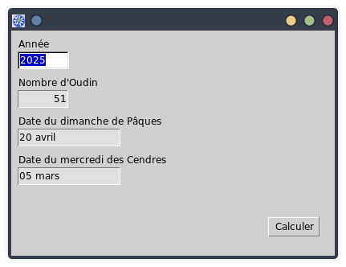

# Easter

Projet MSEgui utilisant les unités *EasterDate* et *JulianDayNumber*.

Permet de connaître la date du mercredi des Cendres et de Pâques pour une année donnée.

Pour Fred, afin qu'il n'oublie pas le début du Carême !

